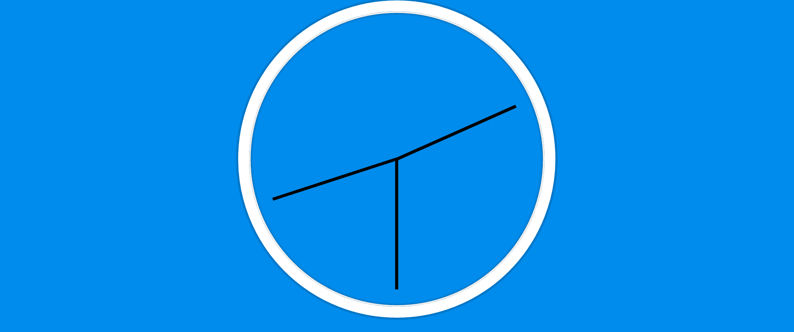

# JS and CSS Clock



Building an Analog clock with JS and CSS

```javascript
let secondHand = document.querySelector('.second-hand'),
    minsHand = document.querySelector('.min-hand'),
    hourHand = document.querySelector('.hour-hand');

function setDate() {
  const now = new Date();

  const secondsDegrees = ((now.getSeconds()/60) * 360) + 90;
  secondHand.style.transform =  `rotate(${secondsDegrees}deg)`;

  const minsDegrees = ((now.getMinutes()/60) * 360) + 90;
  minsHand.style.transform = `rotate(${minsDegrees}deg)`;

  const hourDegrees = ((now.getHours()/12) * 360) + 90;
  hourHand.style.transform = `rotate(${hourDegrees}deg)`;
}

setInterval(setDate, 1000)
```
